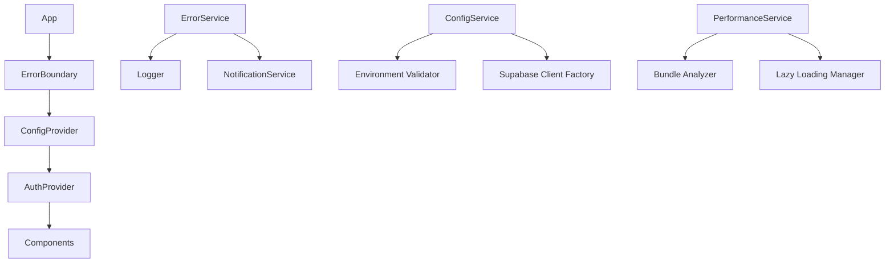

# Documento de Design - Correção de Bugs ZipFast

## Visão Geral

Este documento detalha o design técnico para corrigir bugs críticos no projeto ZipFast. A solução foca em segurança, robustez, performance e experiência do usuário, mantendo a arquitetura existente React/TypeScript + Supabase.

## Arquitetura

### Arquitetura Atual vs. Proposta

**Atual:**
- Tratamento de erro ad-hoc
- Configuração Supabase frágil
- Bundle monolítico
- Logs inconsistentes

**Proposta:**
- Sistema centralizado de tratamento de erros
- Configuração robusta com fallbacks
- Code-splitting e lazy loading
- Sistema de logging estruturado

### Diagrama de Componentes



## Componentes e Interfaces

### 1. Sistema de Tratamento de Erros

#### ErrorBoundary Component
```typescript
interface ErrorBoundaryProps {
  fallback?: React.ComponentType<ErrorFallbackProps>;
  onError?: (error: Error, errorInfo: ErrorInfo) => void;
  children: React.ReactNode;
}

interface ErrorFallbackProps {
  error: Error;
  resetError: () => void;
  retry?: () => void;
}
```

#### ErrorService
```typescript
interface ErrorService {
  captureError(error: Error, context?: ErrorContext): void;
  captureException(exception: unknown, context?: ErrorContext): void;
  setUser(user: User): void;
  setTag(key: string, value: string): void;
}

interface ErrorContext {
  component?: string;
  action?: string;
  userId?: string;
  metadata?: Record<string, any>;
}
```

### 2. Sistema de Configuração

#### ConfigService
```typescript
interface ConfigService {
  validateEnvironment(): ValidationResult;
  getSupabaseConfig(): SupabaseConfig | null;
  isSupabaseEnabled(): boolean;
  getFeatureFlags(): FeatureFlags;
}

interface ValidationResult {
  isValid: boolean;
  errors: ConfigError[];
  warnings: ConfigWarning[];
}
```

#### Environment Validator
```typescript
interface EnvironmentValidator {
  validateRequired(variables: string[]): ValidationResult;
  validateOptional(variables: string[]): ValidationResult;
  generateEnvExample(): string;
}
```

### 3. Sistema de Performance

#### LazyLoadingManager
```typescript
interface LazyLoadingManager {
  loadComponent<T>(importFn: () => Promise<T>): React.LazyExoticComponent<T>;
  preloadComponent(importFn: () => Promise<any>): void;
  getLoadingStats(): LoadingStats;
}
```

#### BundleOptimizer
```typescript
interface BundleOptimizer {
  analyzeDependencies(): DependencyAnalysis;
  suggestOptimizations(): OptimizationSuggestion[];
  implementCodeSplitting(): void;
}
```

### 4. Sistema de Logging

#### Logger Service
```typescript
interface Logger {
  debug(message: string, context?: LogContext): void;
  info(message: string, context?: LogContext): void;
  warn(message: string, context?: LogContext): void;
  error(message: string, error?: Error, context?: LogContext): void;
  setLevel(level: LogLevel): void;
}

interface LogContext {
  userId?: string;
  component?: string;
  action?: string;
  metadata?: Record<string, any>;
}
```

## Modelos de Dados

### Error Models
```typescript
interface AppError extends Error {
  code: string;
  severity: 'low' | 'medium' | 'high' | 'critical';
  context?: ErrorContext;
  timestamp: Date;
  userId?: string;
}

interface NetworkError extends AppError {
  status?: number;
  endpoint?: string;
  retryCount?: number;
}

interface ValidationError extends AppError {
  field?: string;
  value?: any;
  constraint?: string;
}
```

### Configuration Models
```typescript
interface AppConfig {
  supabase: SupabaseConfig;
  features: FeatureFlags;
  performance: PerformanceConfig;
  monitoring: MonitoringConfig;
}

interface SupabaseConfig {
  url: string;
  anonKey: string;
  enabled: boolean;
}

interface FeatureFlags {
  offlineMode: boolean;
  telemetry: boolean;
  advancedCompression: boolean;
}
```

## Tratamento de Erros

### Estratégia de Error Handling

1. **Error Boundaries**: Captura erros de renderização React
2. **Try-Catch Blocks**: Operações assíncronas críticas
3. **Promise Rejection Handling**: Operações de rede
4. **Global Error Handler**: Erros não capturados

### Retry Logic
```typescript
interface RetryConfig {
  maxAttempts: number;
  baseDelay: number;
  maxDelay: number;
  backoffFactor: number;
  retryableErrors: string[];
}

const defaultRetryConfig: RetryConfig = {
  maxAttempts: 3,
  baseDelay: 1000,
  maxDelay: 10000,
  backoffFactor: 2,
  retryableErrors: ['NETWORK_ERROR', 'TIMEOUT', 'SERVER_ERROR']
};
```

### Error Recovery Strategies

1. **Automatic Retry**: Para erros de rede temporários
2. **Fallback Mode**: Quando Supabase não está disponível
3. **User Retry**: Para operações que o usuário pode tentar novamente
4. **Graceful Degradation**: Funcionalidade limitada quando serviços estão indisponíveis

## Estratégia de Testes

### Testes de Unidade
- Componentes de tratamento de erro
- Serviços de configuração
- Utilitários de validação
- Hooks customizados

### Testes de Integração
- Fluxo completo de compressão
- Autenticação com Supabase
- Tratamento de erros end-to-end
- Performance de carregamento

### Testes de Performance
- Bundle size analysis
- Loading time benchmarks
- Memory usage profiling
- Network request optimization

### Testes de Erro
- Simulação de falhas de rede
- Configuração inválida
- Limites de arquivo excedidos
- Estados de erro de UI

## Implementação de Performance

### Code Splitting Strategy

1. **Route-based splitting**: Páginas principais
2. **Component-based splitting**: Componentes pesados
3. **Library splitting**: Dependências grandes
4. **Dynamic imports**: Funcionalidades opcionais

### Bundle Optimization

```typescript
// vite.config.ts optimizations
export default defineConfig({
  build: {
    rollupOptions: {
      output: {
        manualChunks: {
          vendor: ['react', 'react-dom'],
          ui: ['@radix-ui/react-dialog', '@radix-ui/react-toast'],
          compression: ['jszip', 'file-saver'],
          supabase: ['@supabase/supabase-js']
        }
      }
    },
    chunkSizeWarningLimit: 400
  }
});
```

### Lazy Loading Implementation

```typescript
// Lazy load heavy components
const CompressionHistory = lazy(() => import('./CompressionHistory'));
const CloudIntegration = lazy(() => import('./CloudIntegration'));
const ProUpgradeModal = lazy(() => import('./ProUpgradeModal'));

// Preload on user interaction
const preloadComponents = () => {
  import('./CompressionHistory');
  import('./CloudIntegration');
};
```

## Monitoramento e Observabilidade

### Métricas de Performance
- Time to First Byte (TTFB)
- First Contentful Paint (FCP)
- Largest Contentful Paint (LCP)
- Cumulative Layout Shift (CLS)
- Bundle size por chunk

### Métricas de Negócio
- Taxa de sucesso de compressão
- Tempo médio de compressão
- Taxa de conversão para PRO
- Uso de créditos por usuário

### Alertas e Notificações
- Taxa de erro > 5%
- Tempo de resposta > 3s
- Bundle size > 500KB
- Falhas de autenticação > 10%

## Configuração de Ambiente

### Arquivo .env.example
```bash
# Supabase Configuration
VITE_SUPABASE_URL=your_supabase_url_here
VITE_SUPABASE_ANON_KEY=your_supabase_anon_key_here

# Feature Flags
VITE_ENABLE_OFFLINE_MODE=false
VITE_ENABLE_TELEMETRY=true
VITE_ENABLE_ADVANCED_COMPRESSION=false

# Performance
VITE_BUNDLE_SIZE_LIMIT=400
VITE_LAZY_LOADING_ENABLED=true

# Monitoring
VITE_SENTRY_DSN=your_sentry_dsn_here
VITE_ANALYTICS_ID=your_analytics_id_here
```

### Validação de Configuração
```typescript
const requiredEnvVars = [
  'VITE_SUPABASE_URL',
  'VITE_SUPABASE_ANON_KEY'
];

const optionalEnvVars = [
  'VITE_SENTRY_DSN',
  'VITE_ANALYTICS_ID'
];
```

## Migração e Compatibilidade

### Estratégia de Migração
1. Implementar novos serviços sem quebrar funcionalidade existente
2. Migrar componentes gradualmente
3. Manter backward compatibility
4. Testes extensivos em cada etapa

### Rollback Plan
- Feature flags para desabilitar novas funcionalidades
- Versioning de configuração
- Backup de estado anterior
- Monitoramento de métricas críticas

## Considerações de Segurança

### Tratamento Seguro de Erros
- Não expor informações sensíveis em logs
- Sanitizar dados de erro antes de enviar para monitoramento
- Implementar rate limiting para tentativas de retry
- Validar todas as entradas de usuário

### Configuração Segura
- Validar variáveis de ambiente
- Usar HTTPS para todas as comunicações
- Implementar CSP headers
- Sanitizar dados de configuração